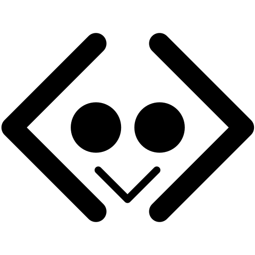

# kidscipher

Kidscipher is an npm library for encoding and decoding educational and fun ciphers. It mainly provides ciphers that can be solved as a game and also includes a custom font `Kidscipher`, which makes it possible to work with graphical ciphers and symbols.

## Install

```bash
npm install kidscipher
```

## Usage

```ts
import { PolandCrossCipher } from 'kidscipher';

const cipher = new PolandCrossCipher();

const encoded = cipher.encode('HELLO');
console.log(encoded);

const decoded = cipher.decode(encoded);
console.log(decoded); // HELLO
```

### Custom font

The font allows you to render encoded text as graphical symbols (necesary only for graphical outputs). The font is automatically included in the package, so you don’t need to import it separately.

```html
<p style="font-family: Kidscipher;">{encoded}</p>
```

### Supported Ciphers

- Substitution Cipher
  - ✅ Shift Cipher
    - ✅ Shift Alphabet
    - ✅ ABCD Shift 3-rotor
    - ❌ Atbash
  - ✅ MorseCode
  - ✅ Poland Cross (need font)
  - ✅ Hebrew Cross (need font)
  - ✅ Small Cross (need font)
  - ✅ Different Cross (need font)
  - ❌ Square Cross (need font)
  - ❌ Knights Templar Cross (need font)
  - ✅ Mobile
  - ✅ Chess
  - ✅ Cipher table - ADFGVX/ADFGX
  - ✅ Fractions (need font)
  - ✅ Spider-Net Cipher
  - ✅ Chinese Cipher (need font)
  - ❌ Playfair
  - ❌ Vigenere
  - ❌ Binary
  - ❌ Brail
  - ❌ Sign Language
  - ❌ Semaphore Flag
- Trasposition ciphers
  - ❌ Route cipher (Hadovka)
  - ❌ Reverse Text
  - ❌ Word Reversal Cipher
  - ❌ Rail fence
  - ❌ Scytale
  - ❌ Anagram Cipher
- Steganography ciphers
  - Null Cipher
    - ❌ Case Steganography

> ✅ - implemented and showcased in docs
> 🔄 - implemented, but not showcased in docs
> ❌ - not implemented

## Development

The main focus of the project is to provide a lightweight, dependency-minimal library with high customization for ciphers.

All ciphers are text-based (even the graphical ones).
The graphical part is powered by the Kidscipher font, which is automatically generated by the script `scripts/generate-font`.

This generator maps symbols to Unicode, so every graphical cipher is just normal text rendered with the custom font.

### Setup

1. Install dependencies:

   ```bash
   npm install
   ```

2. Prebuild fonts:

   ```bash
   npm run prebuild-fonts
   ```

3. Build the package:

   ```bash
   npm run build
   ```

### Local testing in another project

To try the package in a different project without publishing to npm, you can link the built `dist` folder directly:

```json
{
  "dependencies": {
    "kidscipher": "file:../dist"
  }
}
```

> **Note:** After adding the dependency, you **must run `npm install`** in the new project.
> This will create a symlink to the `../dist` folder, so any updates you rebuild in `kidscipher` will be immediately available in the new project without reinstalling, as long as the folder structure remains the same.

## Contributing

Contributions are welcome!
